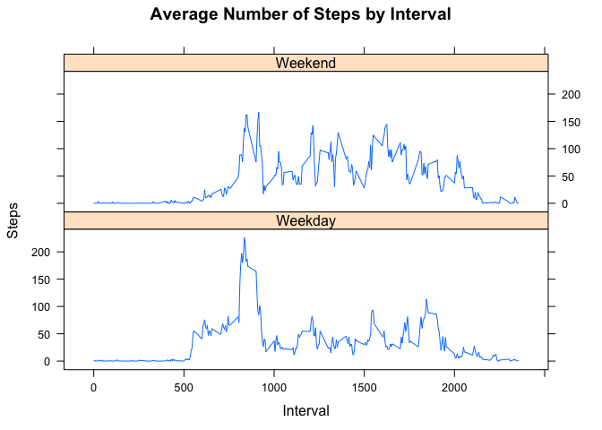

## Loading and preprocessing the data

1. Load the data 


```r
data <- read.csv("activity.csv")
```


## What is mean total number of steps taken per day?

1. Calculate the total number of steps taken per day (stepsDaily)
2. Make a histogram of the total number of steps taken each day
3. Calculate and report the mean (meanSteps) and median (medianSteps) of the total number of steps taken per day


```r
stepsDaily <- aggregate(steps ~ date, data, sum)
hist(stepsDaily$steps, main = paste("Total Number of Steps Taken Each Day"), col = "red", xlab = "Number of Steps")
```

<!-- -->

```r
meanSteps <- mean(stepsDaily$steps)
medianSteps <- median(stepsDaily$steps)
```


```r
meanSteps
```

```
## [1] 10766.19
```


```r
medianSteps
```

```
## [1] 10765
```

## What is the average daily activity pattern?

1. Make a time series plot of the 5-minute interval and the average number of steps taken, averaged across all days
2. Find which 5-minute interval, on average across all the days in the dataset, contains the maximum number of steps (maxSteps)


```r
stepIntervals <- aggregate(steps ~ interval, data, mean)
plot(stepIntervals$interval,stepIntervals$steps, type = "l", xlab = "Interval", ylab = "Number of Steps", main = "Average Number of Steps Taken by Interval")
```

<!-- -->

```r
maxSteps <- stepIntervals[which.max(stepIntervals$steps) , 1 ]
```


```r
maxSteps
```

```
## [1] 835
```

## Impute missing values. Compare imputed to non-imputed data.

1. Calculate and report the total number of missing values in the dataset (missData)
2. Create a new dataset that is equal to the original dataset but with the missing data filled in (imputed)
3. Make a histogram of the total number of steps taken each day
4. Calculate and report the mean (newMean) and median (newMedian) total number of steps taken per day 
5. Check if the calculated mean and median values differ from the estimates from the first part of the assignment (finalMean / finalMedian)
6. Express the impact of imputing missing data on the estimates of the total daily number of steps (finalSteps)


```r
missData <- sum(!complete.cases(data))
imputed <- transform(data, steps = ifelse(is.na(data$steps), stepIntervals$steps[match(data$interval, stepIntervals$interval)] , data$steps))
```


```r
imputed[as.character(imputed$date) == "2012-10-01", 1 ] <- 0
```


```r
newStepsDaily <- aggregate(steps ~ date, imputed, sum)
hist(newStepsDaily$steps, main = paste("Total Number of Steps Taken Each Day"), col = "red" , xlab = "Steps")
hist(stepsDaily$steps, main = paste("Total Number of Steps Taken Each Day"), col = "green" , xlab = "Steps", add = TRUE)
legend("topright", c("Imputed", "Non-Imputed"), col = c("red", "green"), lwd = 3)
```

<!-- -->


```r
newMean <- mean(newStepsDaily$steps)
newMean
```

```
## [1] 10589.69
```


```r
newMedian <- median(newStepsDaily$steps)
newMedian
```

```
## [1] 10766.19
```


```r
finalMean <- newMean-meanSteps
finalMean
```

```
## [1] -176.4949
```


```r
finalMedian <- newMedian-medianSteps
finalMedian
```

```
## [1] 1.188679
```


```r
finalSteps <- sum(newStepsDaily$steps)-sum(stepsDaily$steps)
finalSteps
```

```
## [1] 75363.32
```

Imputing missing data on the estimates of the total daily number of steps resulted in an increase in number of steps.


## Are there differences in activity patterns between weekdays and weekends?

1. Create a new factor variable in the dataset with two levels – “weekday” and “weekend” indicating whether a given date is a weekday or weekend day
2. Make a panel plot containing a time series plot of the 5-minute interval and the average number of steps taken, averaged across all weekday days or weekend days 


```r
library(lattice)
weekdays <- c("Monday", "Tuesday", "Wednesday", "Thursday", "Friday")
imputed$dow = as.factor(ifelse(is.element(weekdays(as.Date(imputed$date)), weekdays), "Weekday" , "Weekend"))
newInterval <- aggregate(steps ~ interval + dow, imputed, mean)
xyplot(newInterval$steps ~ newInterval$interval | newInterval$dow, main = "Average Number of Steps by Interval", xlab = "Interval", ylab = "Steps", layout = c(1,2), type = "l")
```

<!-- -->

There is more physical activity performed during weekends compared to weekdays.
